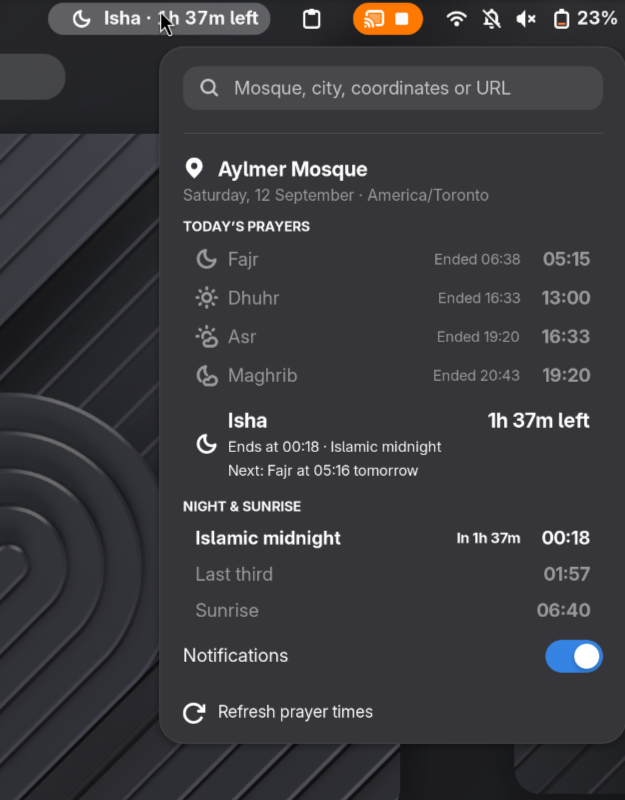

# Mawaqit GNOME top bar

GNOME Extension that adds icon in top bar that shows next prayer time based on MAWAQIT. Supports notifications, third-of-night, midnight

```sh
curl -fsSL https://raw.githubusercontent.com/akramboussanni/mawaqit-gnome/main/install.sh | sh
```


